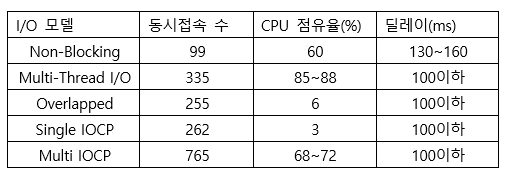
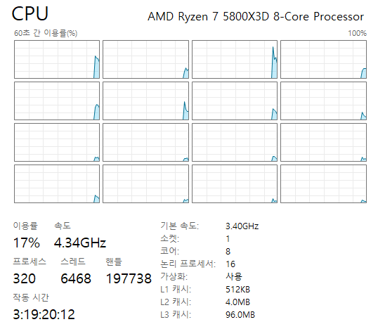
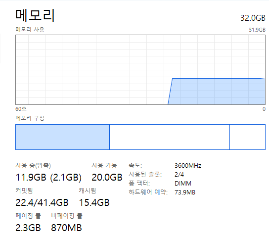

# 03. IOCP — I/O Model & Multi-thread Server

여러 I/O 처리 모델을 직접 구현하고 비교한 뒤, **IOCP(I/O Completion Port)와 Worker Thread 기반 서버**로 확장한 단계입니다.

동일한 로그인·이동·접속 해제 로직을 서로 다른 I/O 모델에 적용하여 구조와 확장성의 차이를 확인했습니다.

## 구현한 서버 모델

| 파일 | 구조 |
| --- | --- |
| [`non_blocking_io.cpp`](./SERVER/SERVER/non_blocking_io.cpp) | Non-blocking 소켓으로 전체 세션을 반복 검사 |
| [`multi_thread_io.cpp`](./SERVER/SERVER/multi_thread_io.cpp) | 클라이언트별 Thread에서 수신 처리 |
| [`overlapped_server.cpp`](./SERVER/SERVER/overlapped_server.cpp) | Overlapped I/O + Completion Routine |
| [`single_iocp_server.cpp`](./SERVER/SERVER/single_iocp_server.cpp) | 단일 Thread에서 IOCP 완료 이벤트 처리 |
| [`multi_iocp_server.cpp`](./SERVER/SERVER/multi_iocp_server.cpp) | 여러 Worker Thread가 IOCP 완료 이벤트 처리 |

## Multi-thread IOCP 구조

```text
                ┌──────── Client Socket
                │
                ├──────── Client Socket
                │
                └──────── Client Socket
                         │
                         ▼
                I/O Completion Port
                         │
          ┌──────────────┼──────────────┐
          ▼              ▼              ▼
      Worker 1       Worker 2       Worker N
          │              │              │
      ACCEPT/RECV     RECV/SEND      RECV/SEND
```

`GetQueuedCompletionStatus()`로 완료된 I/O를 가져오고, `OVER_EXP::_comp_type`을 이용해 `ACCEPT`, `RECV`, `SEND` 작업을 구분합니다.

Worker Thread 수는 `std::thread::hardware_concurrency()`를 기준으로 생성합니다.

## TCP 패킷 경계 처리

TCP는 한 번의 `recv`와 한 개의 패킷이 항상 일치하지 않으므로 패킷의 첫 바이트에 크기를 두고 수신 데이터를 반복 분리합니다.

```text
수신 Buffer
┌──────────┬──────────┬─────────────
│ Packet A │ Packet B │ Packet C 일부
└──────────┴──────────┴─────────────
                          │
                          └─ _prev_remain에 보존
```

완성되지 않은 패킷은 `_prev_remain`으로 관리하고 다음 수신 데이터와 이어서 처리합니다.

## 동시성 처리

Multi-thread IOCP 버전에서는 여러 Worker가 같은 세션 컨테이너와 상태에 접근할 수 있으므로 다음 구조를 사용했습니다.

- `concurrent_unordered_map`으로 세션 컨테이너 관리
- Session 상태 변경 시 `mutex` 사용
- 송신 작업마다 독립된 Overlapped 객체 생성
- 송신 완료 이벤트에서 Overlapped 객체 해제

## Stress Test

부하 테스트용 프로젝트를 별도로 두어 I/O 모델에 따른 서버 동작과 자원 사용을 확인했습니다.

- [`STRESS_TEST`](./STRESS_TEST/)
- CPU 측정 자료
- 메모리 측정 자료
- 서버 모델 성능 비교 자료

### 측정 자료







## 이 단계 이후의 병목

IOCP를 적용해 네트워크 I/O 처리 구조는 개선했지만, 이동한 플레이어의 정보를 **모든 접속자에게 전송**하는 게임 로직은 그대로 남아 있습니다.

접속자가 증가하면 실제로 서로 볼 수 없는 플레이어에게도 이동 패킷을 보내므로 불필요한 탐색과 송신량이 크게 증가합니다.

다음 단계에서는 **View List와 Sector 공간 분할**을 이용해 관심 영역(AOI)만 처리하도록 개선합니다.

> Next: [04. Sector / AOI](../04_Sector/)
