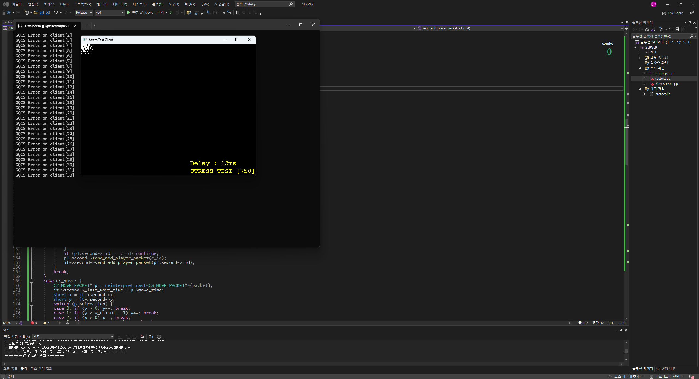
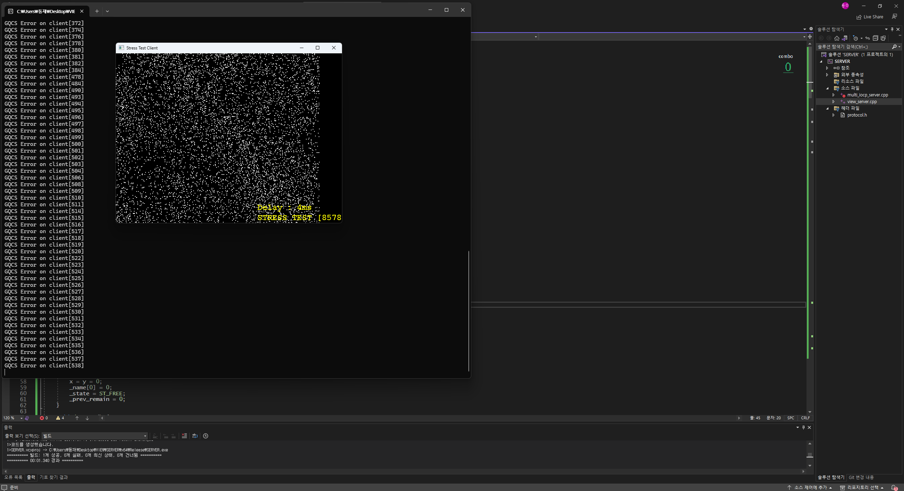
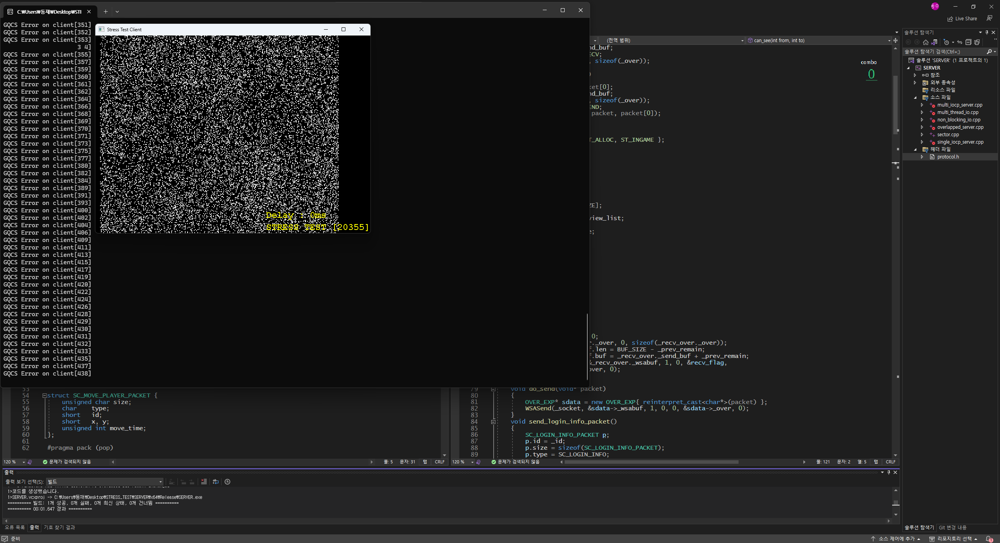

# 04. Sector — AOI & Spatial Partitioning

IOCP 서버에서 접속자가 증가할수록 발생하는 **전체 객체 순회와 불필요한 이동 패킷 전송 문제**를 줄이기 위해 AOI(Area of Interest)와 공간 분할을 적용한 단계입니다.

이 폴더에는 최적화 과정을 비교할 수 있도록 세 가지 서버 구현을 함께 보관했습니다.

## 최적화 과정

```text
mt_iocp.cpp
전체 플레이어에게 이동 전송
        │
        ▼
view_server.cpp
시야 안의 플레이어에게만 전송
        │
        ▼
sector.cpp
주변 Sector만 탐색한 뒤 시야 판정
```

## 1. 전체 전송 — `mt_iocp.cpp`

플레이어가 이동할 때 현재 접속 중인 모든 플레이어를 순회하고 이동 패킷을 보냅니다.

```text
Player Move
    │
    ▼
All Clients Scan
    │
    ▼
Broadcast MOVE
```

구현은 단순하지만 접속자 수가 증가할수록 탐색 횟수와 패킷 전송량이 함께 증가합니다.

## 2. View List — `view_server.cpp`

`VIEW_RANGE`를 기준으로 실제로 서로 볼 수 있는 플레이어만 관리하는 `_view_list`를 추가했습니다.

플레이어 이동 전후의 시야 목록을 비교해 상황에 맞는 패킷을 전송합니다.

- 기존에도 시야 안에 있음 → `MOVE`
- 새로 시야 안에 들어옴 → `ADD`
- 시야 밖으로 나감 → `REMOVE`

이 방식으로 **불필요한 패킷 전송은 감소**하지만, 새로운 시야 목록을 만들기 위해 여전히 전체 `clients`를 순회해야 합니다.

## 3. Sector — `sector.cpp`

월드를 일정 크기의 Sector로 나누고 각 플레이어를 자신의 위치에 해당하는 Sector에 등록합니다.

```text
┌─────┬─────┬─────┐
│     │     │     │
├─────┼─────┼─────┤
│     │ ME  │     │
├─────┼─────┼─────┤
│     │     │     │
└─────┴─────┴─────┘
```

현재 위치의 Sector와 인접한 **3×3 Sector만 검사**한 뒤 `VIEW_RANGE`를 다시 적용해 실제 관심 객체를 찾습니다.

현재 구현 기준:

- `VIEW_RANGE = 5`
- `SECTOR_SIZE = 20`
- Sector별 객체 컨테이너
- Sector별 `mutex`
- 이동 시 Sector 등록 위치 갱신

## 주요 코드

| 파일 | 내용 |
| --- | --- |
| [`mt_iocp.cpp`](./SERVER/SERVER/mt_iocp.cpp) | 전체 접속자 대상 이동 전송 |
| [`view_server.cpp`](./SERVER/SERVER/view_server.cpp) | View List 기반 AOI 처리 |
| [`sector.cpp`](./SERVER/SERVER/sector.cpp) | Sector 공간 분할 기반 주변 객체 탐색 |
| [`STRESS_TEST`](./STRESS_TEST/) | 동시 접속 부하 테스트 |

## 측정 자료

### 시야 처리 적용 전



### View List 적용



### Sector 적용



## 핵심 학습

이 단계에서는 단순히 네트워크 I/O를 빠르게 처리하는 것뿐 아니라, **게임 서버가 어떤 객체의 상태를 누구에게 전송해야 하는지 제한하는 것 자체가 중요한 최적화**라는 점을 확인했습니다.

```text
네트워크 I/O 최적화
        +
게임 월드 탐색 범위 축소
        +
불필요한 패킷 제거
```

다음 단계에서는 이 공간 관리 구조에 대량 NPC와 Timer Event를 추가합니다.

> Next: [05. NPC & Timer](../05_NPC_Timer/)
